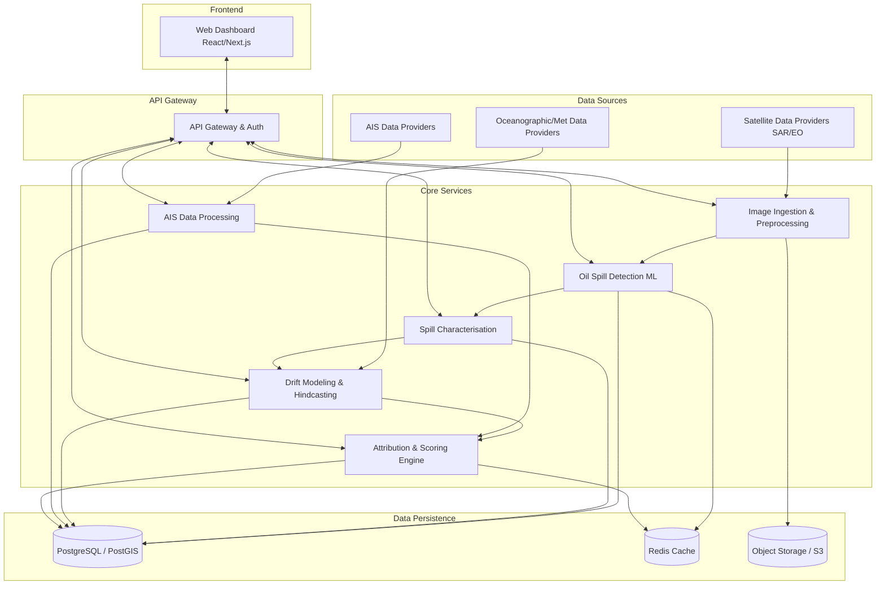
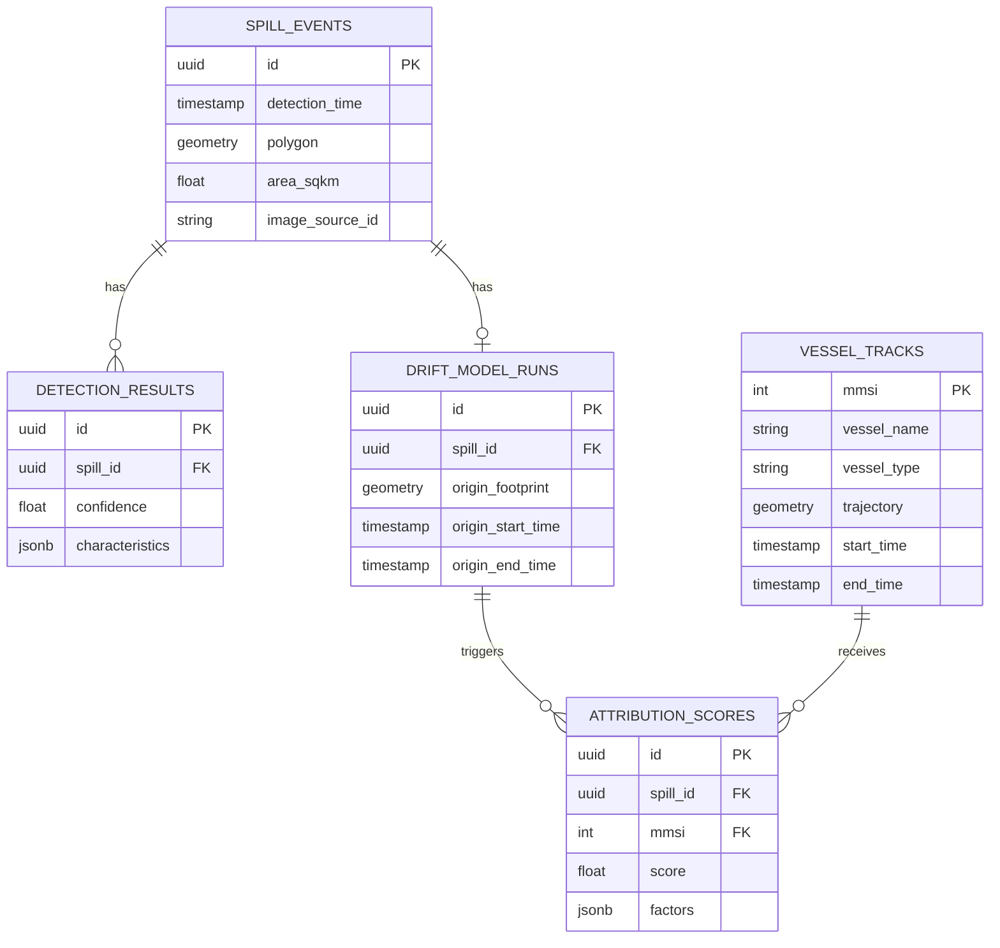

# Software Design Document (SDD)
## Leveraging Satellite Imagery to Determine Oil Spills at Sea and AIS Data Correlations to Identify Responsible Vessels

**Problem Statement ID:** 26143  
**Organization:** National Technical Research Organisation (NTRO)  
**Theme:** Disaster Management  
**Date:** September 2026  

---

## 1. Introduction

### 1.1 Purpose
This Software Design Document (SDD) outlines the architectural and detailed design for an automated pipeline to detect oil spills at sea using satellite imagery (SAR and EO) and correlate this data with Automatic Identification System (AIS) data to identify the responsible vessel. This document serves as the primary reference for the development team, outlining system components, interfaces, database schemas, and the overarching architecture required to fulfill the requirements of SIH 2026 Problem Statement 26143.

### 1.2 Scope
The system will provide an end-to-end automated pipeline comprising:
- Ingestion of remote sensing satellite data (SAR/EO).
- Detection and characterization of oil spills (area, geometry, age).
- Drift modeling (hindcasting and forecasting) using oceanographic and meteorological data.
- Processing of historic AIS data to reconstruct vessel trajectories.
- An attribution engine to score suspect vessels based on spatio-temporal correlation.
- An interactive web-based dashboard for visualization and reporting.

### 1.3 Definitions, Acronyms, and Abbreviations
- **AIS:** Automatic Identification System
- **API:** Application Programming Interface
- **DL:** Deep Learning
- **EO:** Electro-Optical
- **ML:** Machine Learning
- **SAR:** Synthetic Aperture Radar
- **SDD:** Software Design Document
- **SIH:** Smart India Hackathon
- **UI/UX:** User Interface / User Experience
- **CNN:** Convolutional Neural Network
- **GNOME:** General NOAA Operational Modeling Environment

### 1.4 References
- IEEE Std 1016-2009 - IEEE Standard for Information Technology—Systems Design—Software Design Descriptions.
- Problem Statement 26143 - National Technical Research Organisation (NTRO).

---

## 2. System Overview & Architecture

The system follows a microservices-based architecture to ensure scalability, maintainability, and high availability. It integrates distinct data processing pipelines for imagery and AIS data, converging at an attribution engine, and visualized through a modern web application.

### 2.1 High-Level Architecture Diagram

### 2.2 Technology Stack
- **Backend Framework:** Python (FastAPI/Flask)
- **Machine Learning & Deep Learning:** TensorFlow, PyTorch
- **Drift Modeling:** OpenDrift (or PyGNOME)
- **Frontend Framework:** React.js / Next.js
- **Database:** PostgreSQL with PostGIS extension (for spatial data)
- **Caching & Message Broker:** Redis, RabbitMQ / Celery
- **Containerization & Orchestration:** Docker, Kubernetes
- **Cloud/Object Storage:** AWS S3 (or MinIO for local deployment)

---

## 3. Architectural Design

### 3.1 System Architecture Pattern
The system employs a **Microservices Architecture**. This is chosen because the system involves computationally intensive ML tasks, high-volume data streams (AIS), and standard web serving. Decoupling these components allows them to scale independently.

### 3.2 Component Decomposition
- **Satellite Image Ingestion & Preprocessing:** Handles downloading, calibrating, and tiling satellite images.
- **Oil Spill Detection:** Executes ML inference on processed tiles.
- **Spill Characterisation:** Calculates polygon geometries and extracts features.
- **Drift Modeling:** Performs particle tracking backward in time (hindcast) and forward (forecast).
- **AIS Data Processing:** Cleans, interpolates, and stores vessel tracks.
- **Vessel Attribution Engine:** Fuses the output of Drift Modeling and AIS Processing to rank suspects.
- **Web Dashboard:** The visual interface for users.
- **API Gateway & Auth:** Routes requests, handles authentication (JWT), and rate-limiting.

### 3.3 Data Flow
1. **Trigger:** A new satellite image becomes available for a monitored region.
2. **Ingestion:** The image is ingested, pre-processed (e.g., speckle filtering for SAR), and stored in Object Storage.
3. **Detection:** The Oil Spill Detection module pulls the image, runs segmentation models, and outputs bounding boxes/polygons.
4. **Characterization:** The geometry, area, and estimated age are computed and stored in PostGIS.
5. **Drift Modeling:** Using ocean currents and wind data, the drift model calculates the expected origin point and time window.
6. **AIS Query:** The system queries the AIS database for vessels near the computed origin point during the estimated time window.
7. **Attribution:** The engine correlates vessel tracks with the drift path, scores them for anomalies and proximity, and saves the results.
8. **Visualization:** The Web Dashboard fetches the results via the API Gateway to display on a map overlay.

---

## 4. Detailed Design for Each Module

### 4.1 Satellite Image Ingestion & Preprocessing Module
- **Purpose:** Prepare raw EO and SAR imagery for ML models.
- **Operations:**
  - Land masking to avoid false positives on coastlines.
  - Radiometric calibration and speckle filtering (Lee filter) for SAR images.
  - Tiling large GeoTIFFs into 512x512 or 1024x1024 patches for inference.
- **Interfaces:** Connects to external satellite APIs (e.g., Copernicus, Sentinel Hub), stores raw and processed data in Object Storage.

### 4.2 Oil Spill Detection Module
- **Purpose:** Identify pixels containing oil spills.
- **Algorithm/Model:** Deep Learning segmentation using U-Net or DeepLabV3+ architectures, pre-trained on datasets like the SAR Oil Spill Dataset.
- **Pipeline:**
  - Receive image tile stream.
  - Model inference (GPU accelerated).
  - Post-processing (polygonization of masks, morphological operations to remove noise).
  - Vectorization of outputs into GeoJSON formats.
- **Interfaces:** Receives data from Ingestion Module, sends polygons to Characterisation Module.

### 4.3 Spill Characterisation Module
- **Purpose:** Analyze detected spills to extract physical parameters.
- **Computations:**
  - **Geometric Properties:** Area, perimeter, length, width, and shape complexity index.
  - **Age Estimation:** Feasibility study using SAR backscatter characteristics (damping ratio) and weathering models.
- **Outputs:** Structured JSON containing physical traits, stored in the database.

### 4.4 Drift Modeling & Hindcasting Module
- **Purpose:** Track the movement of the oil slick backward to find its source and forward to predict its impact.
- **Integration:** Utilizes OpenDrift or PyGNOME.
- **Inputs:**
  - Slick polygons (from Characterisation).
  - Oceanographic data (currents, temperature) via NetCDF files (e.g., HYCOM).
  - Meteorological data (wind speed, direction) (e.g., GFS/ECMWF).
- **Process:** Run particle tracking algorithms backward in time. Extract a probabilistic origin footprint (a polygon defined by particle density) and a time window.
- **Outputs:** Spatio-temporal origin window.

### 4.5 AIS Data Processing Module
- **Purpose:** Manage and reconstruct vessel trajectories.
- **Operations:**
  - Parse NMEA/AIS messages.
  - Filter out invalid data (e.g., erroneous MMSI, impossible speeds).
  - Trajectory reconstruction: Interpolate missing points to create continuous path linestrings.
  - Spatial indexing in PostGIS for rapid querying.
- **Database:** Uses `vessel_tracks` and `ais_records` tables.

### 4.6 Vessel Attribution & Scoring Engine
- **Purpose:** Identify the most likely vessel responsible for the spill.
- **Algorithm:**
  - Extract the origin footprint and time window from the Drift Module.
  - Query the AIS module for all vessels intersecting the footprint within the time window.
  - **Scoring Parameters:**
    - *Proximity:* Distance between vessel track and calculated spill origin point.
    - *Trajectory alignment:* Does the vessel's path align with the shape of the slick?
    - *Behavioral Anomalies:* Sudden changes in speed, course, or AIS transmission gaps (often indicative of illegal dumping).
- **Output:** A ranked list of candidate vessels with confidence scores (0-100%).

### 4.7 Dashboard & Visualization Module
- **Purpose:** Provide a user interface for monitoring and analysis.
- **Features:**
  - Interactive Map (Leaflet/Mapbox GL JS) showing SAR/EO overlays, detected slick polygons, drift particle paths, and vessel tracks.
  - Alert panel for new detections.
  - Detailed report view for a specific spill event and the suspected vessels.
- **Framework:** Next.js with React.

### 4.8 API Gateway & Authentication Module
- **Purpose:** Centralized entry point and security layer.
- **Auth:** JWT-based authentication, Role-Based Access Control (RBAC) for Admin, Analyst, and Viewer.
- **Routing:** Forward requests to appropriate microservices.

---

## 5. Database Design

The database primarily uses PostgreSQL with the PostGIS extension for handling complex geographical queries.

### 5.1 Entity-Relationship Overview

### 5.2 Table Schemas

**Table: spill_events**
| Column Name | Data Type | Description |
| :--- | :--- | :--- |
| id | UUID | Primary Key |
| detection_time | TIMESTAMP | Time of image capture |
| polygon | GEOMETRY(Polygon, 4326) | Spatial footprint of the spill |
| area_sqkm | FLOAT | Area in square kilometers |
| image_source_id | VARCHAR | Reference to the raw image in object storage |

**Table: ais_records (Raw data, partitioned by date)**
| Column Name | Data Type | Description |
| :--- | :--- | :--- |
| id | BIGSERIAL | Primary Key |
| mmsi | INTEGER | Vessel Identifier |
| timestamp | TIMESTAMP | Time of AIS message |
| location | GEOMETRY(Point, 4326) | Vessel coordinates |
| speed | FLOAT | Speed over ground |
| course | FLOAT | Course over ground |

**Table: attribution_scores**
| Column Name | Data Type | Description |
| :--- | :--- | :--- |
| id | UUID | Primary Key |
| spill_id | UUID | Foreign Key -> spill_events.id |
| mmsi | INTEGER | Foreign Key -> vessel_tracks.mmsi |
| score | FLOAT | Overall confidence score (0-100) |
| factors | JSONB | Breakdown of score (proximity, anomaly, etc.) |

---

## 6. Interface Design

### 6.1 REST API Endpoints

| Endpoint | Method | Description | Roles |
| :--- | :--- | :--- | :--- |
| `/api/v1/auth/login` | POST | Authenticate user and return JWT | All |
| `/api/v1/spills` | GET | Retrieve list of spill events with filters (date, area) | Analyst, Viewer |
| `/api/v1/spills/{id}` | GET | Get detailed info for a specific spill | Analyst, Viewer |
| `/api/v1/spills/{id}/drift`| POST | Trigger manual drift model run | Analyst |
| `/api/v1/spills/{id}/suspects`| GET | Get ranked list of suspect vessels | Analyst, Viewer |
| `/api/v1/vessels/{mmsi}/track`| GET | Get vessel trajectory for a specific time window | Analyst, Viewer |
| `/api/v1/ingest/trigger` | POST | Manually trigger satellite image ingestion | Admin |

### 6.2 WebSocket Events
For real-time dashboard updates:
- `spill_detected`: Emitted when the ML pipeline identifies a new spill.
- `drift_calculation_complete`: Emitted when the hindcasting model finishes.
- `attribution_complete`: Emitted when the scoring engine finishes analyzing suspects.

---

## 7. Security Design

- **Data in Transit:** All communications encrypted via TLS 1.3 (HTTPS/WSS).
- **Authentication:** JWT tokens with short expiry, backed by refresh tokens stored securely in HTTP-only cookies.
- **Authorization:** Granular RBAC enforced at the API Gateway level.
- **Data at Rest:** Sensitive data (if any, like user passwords) hashed using Argon2. Object storage buckets will have strict IAM policies preventing public read access.
- **Input Validation:** Pydantic models (FastAPI) used to rigorously validate all incoming API payloads to prevent injection attacks.

---

## 8. Deployment Architecture

The solution is designed to be cloud-agnostic, deployable via Kubernetes.

- **Containerization:** All modules packaged as Docker images.
- **Orchestration:** Kubernetes (K8s) manages the lifecycle of microservices.
  - ML Inference pods will have `nodeSelectors` to run on GPU-enabled nodes.
  - AIS processing pods will be configured for high memory/CPU allocation.
- **CI/CD:** 
  - GitHub Actions / GitLab CI pipeline to build, run unit/integration tests, and push images to a Container Registry.
  - ArgoCD for GitOps-style continuous deployment to the K8s cluster.
- **Networking:** Ingress controller (NGINX) to manage external access to the API Gateway and Frontend.

---

## 9. Error Handling & Logging

- **Logging Framework:** Python's `logging` module configured to output structured JSON logs.
- **Centralized Logging:** Logs from all microservices forwarded to an ELK stack (Elasticsearch, Logstash, Kibana) or Grafana Loki.
- **Monitoring:** Prometheus scrapes metrics from services (CPU, RAM, API response times, model inference times). Grafana dashboards visualize these metrics.
- **Error Handling Strategy:**
  - Microservices return standardized JSON error responses (Code, Message, Details).
  - Retry mechanisms (using tools like Celery) for transient failures in asynchronous tasks (e.g., downloading images).
  - Dead Letter Queues (DLQ) for failed message processing.
  - Automated alerts (via Slack/Email integration) for critical failures (e.g., DB connection loss, ML inference crash).
